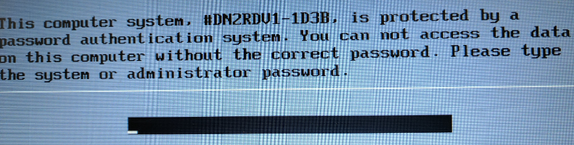
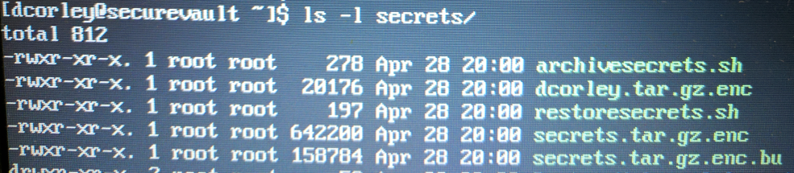
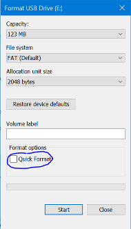

# secrets
Secrets Handling

Guidlines for protecting passwords and access keys.

If your laptop is lost or stolen, there should be no way an attacker can access any of our systems.

First line of defense for Windows or Linux systems. Create a BIOS password.
This renders your system unusable.

Encrypt your hard drive. An unencrypted hard drive can easily be accessed.
Remember to save your encryption keys off-site.

Encrypt your secrets. Passwords, access keys, SSL certs, etc., should only
be unencrypted when needed.

The safest way to transfer secrets to another person is to have the
recepient enter a password to encrypt the files and transfer the files
via USB. When you get the drive back, remember to do a full format. 

